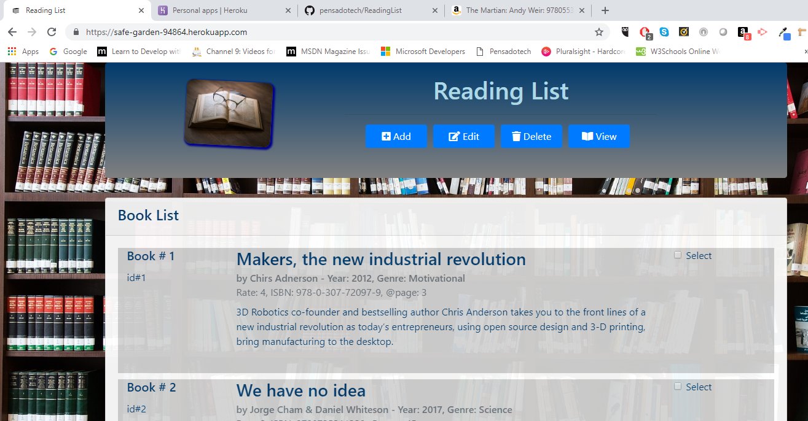
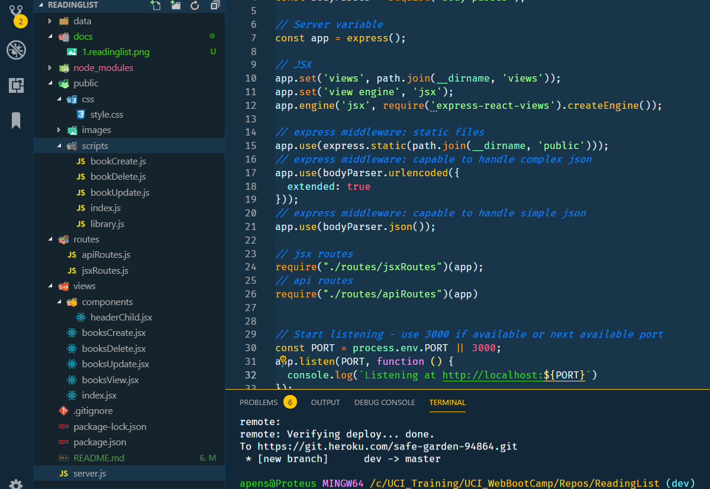

# ReadingList

by Armando Pensado

## Description

The application was made using Node JS, Express, and JSX. IT offers a good example how to use react templates in the server, filling the placeholder with data stored in the server itself. 

The application encapsulates html and API routes in different custom modules, keeping separated the functionality.  Additionally, the core functionality of the application is stored under an additional module inside the ‘data’ folder.

The application stores a list of books in a bookshelf object, using a Book object constructor to manipulate the data. The application is one step to store the data in a database.

## How does it work

To get a sense of the application running in a server, the reader can try the address under Heroku:

* Heroku: https://safe-garden-94864.herokuapp.com/



The application main pages will show a list of books (if any), offering key information about the book. The user can add additional books to the list, edit exiting ones, delete, or just view the details.

For Edit, Delete, or view the user must use the checkbox to select the book for which the action will be applied. If the user fails to do so, the application will present a reminder use a modal screen. Every action is a two-step process. For example, delete will present the data and expect user confirmation before proceeding with the action.

## Who can benefit from this application

This application is beneficial for NodeJS developer, providing sample programming structures using JavaScript, and using **Express**, **JSX**, and custom-made modules that encapsulate the data.

## How developers can get started

To start, the developer must have NodeJS installed in the computer. After, that the project can be cloned and initialized.  Here are the steps for getting started.

1. Install NodeJS into the computer  (https://nodejs.org/en/). Download button and run through the installation file.

2. Clone or Fork the project into the computer.

3. In the folder project, Make a `.gitignore` file and add the following lines to it. This will tell git not to track these files, and thus they won't be committed to Github.

```js
node_modules
.DS_Store
```

5. Bring all external module dependencies using the command:


```js
node i
```

After, the initialization, and using Microsoft Visual Code, the project folder should resemble as depicted below, and should be ready for execution.



## Who maintains and contributes to the project

This is a personal project based on UCI Bootcamp training. 

## Where users can get help with the project

The developer can refer to the following links:


* NodeJs  : https://nodejs.org/en/
* Express : https://www.npmjs.com/package/express
* Heroku  : https://devcenter.heroku.com/articles/getting-started-with-nodejs
* Express-react-views: https://www.npmjs.com/package/express-react-views
